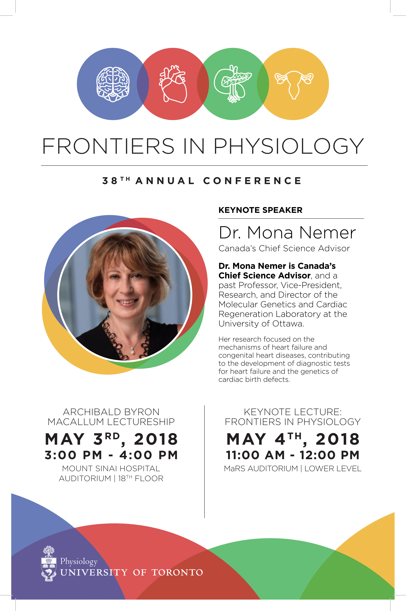

Frontiers in Physiology (FIP) is the Department of Physiology's annual research day, bringing together researchers from all of our platforms. This year, the 38ths annual FIP will be held on May 4, 2018 at the MaRS Auditorium. **Abstract submission has now closed, but registration to attend is still open.**

[38th Annual FIP Registration Form](https://goo.gl/forms/SuEQwKds8TEkZfsR2)

We are thrilled to welcome Dr. Mona Nemer, a distinguished cardiac researcher and Canada's Chief Science Advisor, as our Keynote Speaker. Dr. Nemer's work focuses on the molecular mechanisms of heart development and function, heart failure, and congenital heart disease.

To see how it went last year, check out our FIP2017 recap video:

<iframe src="https://www.youtube.com/embed/HKkefvmOOFI?ecver=2" width="640" height="360" frameborder="0" style="position:absolute;width:100%;height:100%;left:0" allowfullscreen></iframe>

